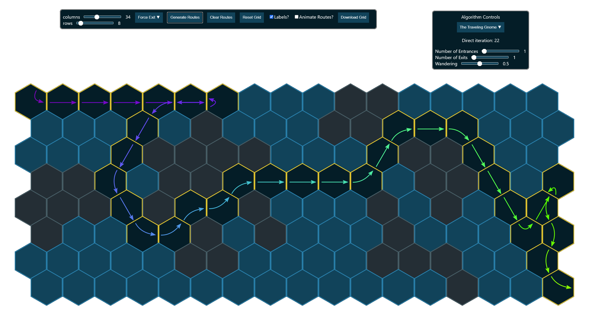

# Tower Defense Enemy Route Generator

This project is a toy for generating enemy routes for tower defense games on hexagonal grids. It is intended as a prototype for procedural route generation. I make no claims that what it generates is interesting or feasible.

## Repository Structure
In an attempt to keep the interesting algorithmy bits portable and distinct from the UI bits, the repository is broken into two major parts.

### UI
The UI (under [src/components](./src/components)) contains UI contains UI code, which is itself broken into (react) components. The controls for setting up the grid and route generation algorithms page are managed in [src/components/controls/controls.tsx](./src/components/controls/controls.tsx). The display grid, which manages the hexagonal cells shown in the UI and displaying/saving generated routes is in [src/components/grid/grid.tsx](./src/components/grid/grid.tsx).

### Route Generation
The logic for generating routes is housed in ([src/model](./src/model)). The main two classes you can use as a starting point are [Grid](./src/model/grid/grid.ts) and [Generator](./src/model/generator/generator.ts).

## Route Generation Algorithms
Below are short descriptions of the current route generating algorithms.

### Drunkard
Generates enemy route(s) by taking a random walk across the grid. I'd be there in a jiffy, if only the world werent so topsy turvy. 

### Direct
Generates enemy route(s) attempting to take a direct route from entrance(s) to exit(s). Routes are generated using dijkstra's algorithm with a randomly generated cost surface that looks (roughly) like mountainness terrain. Increasing the randomness of the algorithm results in an attempt to create more circuitous routes from from entrance to exit.

### The Traveling Gnome
Generates enemy route(s) by taking detours along a direct(ish) route from entrance(s) to exit(s). The number of detours and tortuosity of detours is controlled by the wandering parameter.

### On Entrances and Exits
There are two ways to configure the entrances and exits used for routes. First is by dialing the number of entrances and exits in the algorithm controls. The second is by "painting" individual cells to be entrances or exits. These can be combined.

- If there are more forced entrances than exits, exits will be reused.
- If there are more forced exits than entrances, entrances will be reused.
- If there are zero forced entrances (exits), then they will be generated from boundary cells. 

## Technology
This project uses React with Typescript and vanilla CSS for generating the UI.
